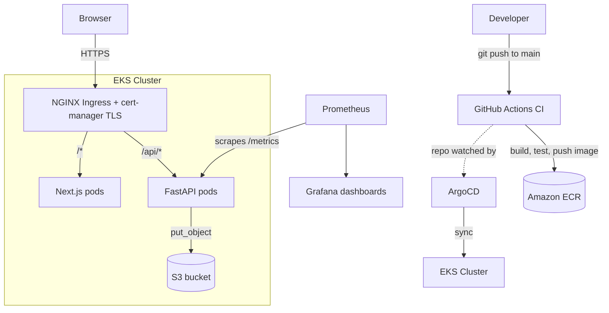
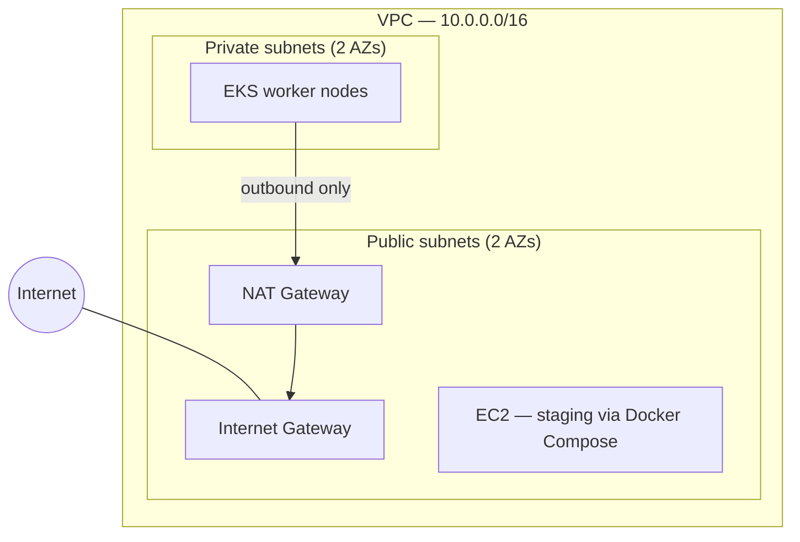

# QR Code Generator — End-to-End DevOps Pipeline

A simple two-tier app (Next.js frontend + FastAPI backend generating QR codes to S3) wrapped in a
full, production-style DevOps pipeline: containerized, provisioned as code, deployed via GitOps,
and observed with a real Prometheus/Grafana stack.

The app itself is intentionally simple — a URL in, a QR code out. The infrastructure and delivery
pipeline around it is the actual point of this repo.

> Base application originally from [rishabkumar7/devops-qr-code](https://github.com/rishabkumar7/devops-qr-code) — this repo builds a complete DevOps platform around it.

---

## Table of contents

- [Architecture](#architecture)
- [Tech stack](#tech-stack)
- [Repository structure](#repository-structure)
- [Design decisions](#design-decisions-worth-knowing)
- [Prerequisites](#prerequisites)
- [Setup — from clone to running app](#setup--from-clone-to-running-app)
- [CI/CD pipeline](#cicd-pipeline)
- [Observability](#observability)
- [Tearing down](#tearing-down)

---

## Architecture



**The delivery flow in one sentence:** a `git push` to `main` is the *only* manual step —
GitHub Actions builds and pushes the image, ArgoCD notices the updated manifests/values in this
same repo and syncs the cluster, and Ingress routes real traffic to the new version. Nothing is
ever deployed with a manual `kubectl apply` or `helm upgrade`.

### Network layout



Worker nodes run in private subnets with no direct internet exposure; only the NAT Gateway lets
them reach out (for pulling images, etc.). The staging EC2 box is intentionally public — it's a
separate, cheaper environment from the orchestrated EKS production cluster.

---

## Screenshots

| | |
|---|---|
| App UI | `docs/screenshots/app-ui.png` |
| ArgoCD sync view | `docs/screenshots/argocd-sync.png` |
| Grafana dashboard | `docs/screenshots/grafana-dashboard.png` |
| `kubectl get pods` output | `docs/screenshots/pods-running.png` |

Create a `docs/screenshots/` folder, drop images in with those names, and they'll render inline
here automatically — e.g. ``.

---

## Tech stack

| Layer | Tools |
|---|---|
| Application | Next.js, FastAPI, boto3 (S3) |
| Containerization | Docker (multi-stage builds), Docker Compose |
| CI | GitHub Actions (lint, test, build, push to ECR) |
| Infrastructure as Code | Terraform (VPC, EKS, ECR, IAM, S3 — modular) |
| Orchestration | Kubernetes (EKS), Helm |
| GitOps / CD | ArgoCD |
| Ingress / TLS | NGINX Ingress Controller, cert-manager |
| Observability | Prometheus, Grafana (kube-prometheus-stack) |
| Cloud | AWS (EKS, ECR, EC2, S3, IAM, VPC) |

---

## Repository structure

```
api/                    FastAPI backend
  Dockerfile
  main.py
  test_main.py
front-end-nextjs/       Next.js frontend
  Dockerfile
terraform/
  modules/              Reusable modules: vpc, ecr, iam, eks, s3
  envs/prod/            Environment that wires the modules together
k8s/base/               Hand-written raw Kubernetes manifests (learning stage — not deployed)
helm/qr-code-app/       Helm chart actually deployed by ArgoCD
  templates/
  values.yaml
argocd/                 ArgoCD Application definitions (GitOps entry points)
monitoring/              Prometheus/Grafana Helm values
scripts/
  teardown.sh
  rebuild.sh
.github/workflows/ci.yml
```

---

## Design decisions worth knowing

- **Single NAT Gateway, not one per AZ** — a deliberate cost trade-off for a project that gets
  torn down between sessions rather than run continuously in production.
- **EC2 staging environment, separate from EKS production** — a real "cheap staging /
  orchestrated prod" pattern, not an unused checkbox item.
- **Secrets never committed to git** — Kubernetes Secrets are created manually, directly in the
  cluster. Helm charts only ever *reference* a secret name, never a value.
- **NGINX Ingress Controller over AWS Load Balancer Controller** — simpler for this scope; ALB +
  IRSA is the natural next step toward a more AWS-native setup.
- **Self-signed TLS via cert-manager** — no owned domain for this project, so cert-manager issues
  self-signed certs locally. Swapping in Let's Encrypt later is a one-line `ClusterIssuer` change
  — nothing else in the Ingress needs to change.
- **API accessed via `/api/*` path on the same host as the frontend, not a separate URL** — avoids
  CORS entirely and works around Next.js baking `NEXT_PUBLIC_*` vars in at build time rather than
  runtime.
- **No heavy DevSecOps tooling** — deliberately scoped out (image scanning, policy engines,
  centralized secrets managers) to keep focus on core DevOps skills; each omission is a natural
  "what's next" talking point in an interview.

---

## Prerequisites

Install and configure before starting:

- [AWS CLI](https://docs.aws.amazon.com/cli/latest/userguide/getting-started-install.html) v2, configured (`aws configure`) with an IAM user that has broad permissions (VPC, EKS, EC2, ECR, IAM, S3) for the initial build
- [Terraform](https://developer.hashicorp.com/terraform/install) >= 1.5
- [kubectl](https://kubernetes.io/docs/tasks/tools/)
- [Helm](https://helm.sh/docs/intro/install/) >= 3.x
- [Docker](https://docs.docker.com/get-docker/) (with Compose)
- An AWS account with billing enabled — this project provisions real, billed resources
-  Use `scripts/teardown.sh` between sessions to delete resources — see [Tearing down](#tearing-down).

---

## Setup — from clone to running app

### 1. Clone the repo

```bash
git clone https://github.com/<your-username>/devops-qr-code.git
cd devops-qr-code
```

### 2. Create an S3 bucket for the app itself

This is the bucket the FastAPI backend writes generated QR codes to — separate from Terraform's
own state bucket in the next step.

```bash
aws s3api create-bucket --bucket <your-app-bucket-name> --region us-east-1
```

### 3. Local development check (optional but recommended first)

```bash
cp api/.env.example .env   # fill in AWS_ACCESS_KEY, AWS_SECRET_KEY, BUCKET_NAME
docker compose up --build
```

Visit `http://localhost:3000`, generate a QR code, confirm it uploads to S3 successfully before
moving to the cloud deployment — this isolates app-level bugs from infrastructure-level ones.

### 4. Bootstrap the Terraform remote state backend

One-time, manual, outside Terraform 

```bash
aws s3api create-bucket --bucket <your-name>-tfstate --region us-east-1
aws s3api put-bucket-versioning --bucket <your-name>-tfstate --versioning-configuration Status=Enabled
aws dynamodb create-table \
  --table-name qr-code-app-tf-locks \
  --attribute-definitions AttributeName=LockID,AttributeType=S \
  --key-schema AttributeName=LockID,KeyType=HASH \
  --billing-mode PAY_PER_REQUEST
```

Update `terraform/envs/prod/backend.tf` with your bucket name.

> **If this is a fresh deployment (nothing pre-exists in your AWS account):** delete or skip
> `terraform/envs/prod/import.tf` if present in your checkout — that file was written to adopt
> *pre-existing* ECR/S3 resources from an earlier manual setup. A brand-new AWS account has
> nothing to import; Terraform should simply create everything fresh.

### 5. Provision AWS infrastructure

```bash
cd terraform/envs/prod
terraform init
terraform plan      # review: VPC, subnets, NAT, EKS cluster + nodes, ECR, IAM, S3 references
terraform apply      # takes 10-15 minutes, mostly EKS cluster creation
cd ../../..
```

### 6. Point kubectl at the new cluster

```bash
aws eks update-kubeconfig --region us-east-1 --name qr-code-app-cluster
kubectl get nodes    # expect 2-3 nodes in Ready status
```

### 7. Create the app's Kubernetes secret (never committed to git)

```bash
kubectl create namespace qr-code-app
kubectl create secret generic qr-app-secrets \
  --namespace qr-code-app \
  --from-literal=AWS_ACCESS_KEY=<your-key> \
  --from-literal=AWS_SECRET_KEY=<your-secret> \
  --from-literal=BUCKET_NAME=<your-app-bucket-name>
```

### 8. Install ArgoCD

```bash
kubectl create namespace argocd
kubectl apply -n argocd -f https://raw.githubusercontent.com/argoproj/argo-cd/stable/manifests/install.yaml
kubectl wait --for=condition=available --timeout=300s deployment/argocd-server -n argocd
```

Get the initial admin password (store it somewhere safe, then delete the secret):

```bash
kubectl -n argocd get secret argocd-initial-admin-secret -o jsonpath="{.data.password}" | base64 -d
```

### 9. Sync everything through ArgoCD, in order

Ingress and cert-manager first — the app's Ingress resource depends on their CRDs existing:

```bash
kubectl apply -f argocd/ingress-nginx-application.yaml
kubectl apply -f argocd/cert-manager-application.yaml
kubectl get pods -n ingress-nginx
kubectl get pods -n cert-manager
```

Then the app itself and monitoring:

```bash
kubectl apply -f argocd/application.yaml
kubectl apply -f argocd/monitoring-application.yaml
```

Before the monitoring sync goes healthy, create its Grafana secret too:

```bash
kubectl create namespace monitoring
kubectl create secret generic grafana-admin-secret \
  --namespace monitoring \
  --from-literal=admin-password=<choose-a-password>
```

Watch everything come up:

```bash
kubectl get applications -n argocd
kubectl get pods -A
```

### 10. Point your browser at the app

Find the Ingress load balancer's hostname:

```bash
kubectl get svc -n ingress-nginx ingress-nginx-controller
```

Resolve it to an IP and add a local override (no owned domain needed for this):

```bash
nslookup <the-elb-hostname>
# then, as Administrator/root:
# Mac/Linux — add to /etc/hosts:      <ip>  qr-app.local
# Windows — add to C:\Windows\System32\drivers\etc\hosts
```

Visit `https://qr-app.local` — your browser will warn about the self-signed certificate
(expected), click through, and confirm the app loads and generates QR codes end-to-end.

### 11. (Optional) Enable CI for your fork

In your GitHub repo: **Settings → Secrets and variables → Actions**, add:

| Secret | Value |
|---|---|
| `AWS_ACCESS_KEY_ID` | scoped-down IAM user with ECR push permissions only |
| `AWS_SECRET_ACCESS_KEY` | " |
| `AWS_ACCOUNT_ID` | your 12-digit account ID |
| `AWS_REGION` | e.g. `us-east-1` |
| `BUCKET_NAME` | your app's S3 bucket name |

Push to `main` and watch the **Actions** tab run.

---

## CI/CD pipeline

Every push to `main`:
1. Lints and tests the API (`flake8`, `pytest`) — tests hit real S3, so CI needs real AWS creds
2. Builds both Docker images, tagging with the commit SHA (never deploying `latest` to Kubernetes)
3. Pushes to Amazon ECR
4. ArgoCD detects the updated manifests/values in this repo and syncs the cluster automatically — no manual deployment step, ever

---

## Observability

Access Grafana:
```bash
kubectl port-forward svc/monitoring-grafana -n monitoring 3000:80
```
Open `http://localhost:3000`, log in `admin` / your chosen password.

Grafana ships with pre-built cluster dashboards out of the box (CPU, memory, pod health) plus a
custom `ServiceMonitor` scraping the FastAPI app's own `/metrics` endpoint — request counts,
latencies, and error rates per route. Try this query in **Explore** after generating a few QR
codes through the app:
```
sum(rate(http_requests_total[5m])) by (handler)
```

Access ArgoCD's UI:
```bash
kubectl port-forward svc/argocd-server -n argocd 8080:443
```
Open `https://localhost:8080` to watch sync status and app health visually.

---

## Tearing down

```bash
./scripts/teardown.sh
```

Removes Kubernetes-created AWS resources (like the Ingress load balancer) *before* running
`terraform destroy` — doing it in the wrong order leaves orphaned ENIs that block VPC deletion.
See the script for the exact sequence.

To bring it all back later:
```bash
./scripts/rebuild.sh
```
Prompts for secrets interactively — nothing sensitive is ever read from a file or stored in git.

---

# Notes on the project:

**note on frontend Dockerfile**
Why three stages: the deps and builder stages contain the full node_modules (including dev dependencies like tailwindcss), source files, and build cache — none of that needs to exist in the image that actually runs in production. Only the compiled .next output and runtime node_modules get copied into the final runner stage, reducing image size and more.


### terraform 
**EKS** needs two separate IAM roles, and mixing them up is the single most common EKS setup mistake, so let's be precise about which is which:

1. Cluster role — assumed by the EKS control plane itself (the managed API server AWS runs for you) so it can manage AWS resources on your behalf (like creating load balancers later).
2. Node role — assumed by the EC2 instances that become your worker nodes, so they can register with the cluster, pull images from ECR, and let the CNI plugin assign pod networking.

Different identities, different jobs — the control plane never runs your pods, and the nodes never manage the API serve

### Ingress: why ?
Ingress fixes this: one load balancer, one entry point, with routing rules deciding which requests go where based on hostname/path — and critically, TLS certificate termination happens in exactly one place instead of being each service's own problem.

Two ways to implement this on EKS — worth knowing both exist
1. NGINX Ingress Controller — a Kubernetes-native controller, cloud-agnostic, works identically on EKS/GKE/AKS/on-prem. Provisions one AWS Network Load Balancer under the hood, then does all the actual host/path routing itself, in-cluster.
2. AWS Load Balancer Controller (ALB Ingress) — AWS-native, provisions a real Application Load Balancer directly, deeper AWS integration (WAF, target groups), but requires setting up IRSA (IAM Roles for Service Accounts) — a genuinely more advanced IAM concept worth knowing exists, but more setup than this milestone needs.

- I used the *NGINX Ingress controller* for this project.